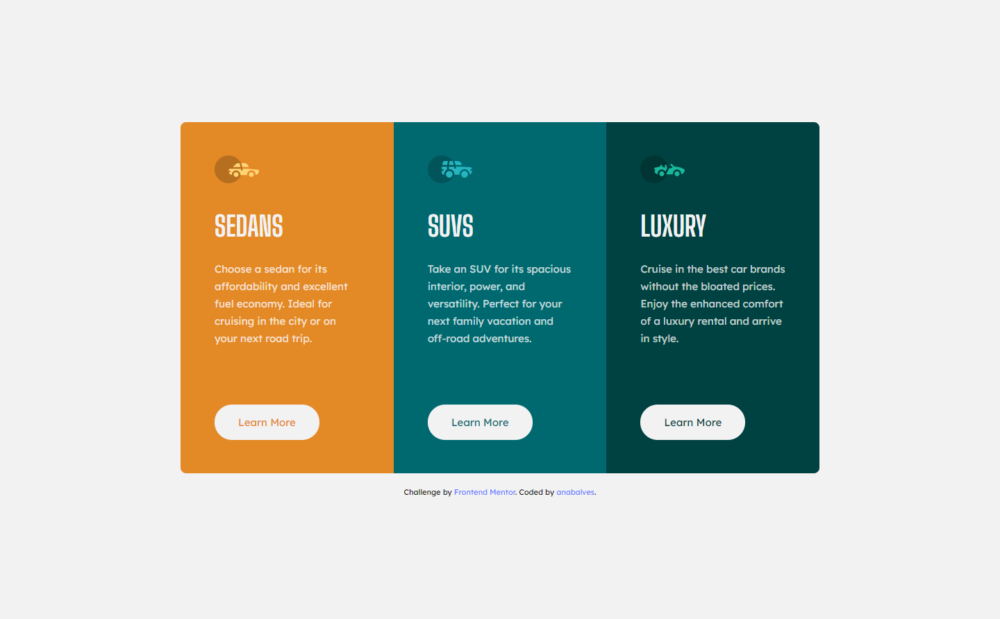

# Frontend Mentor - 3-column preview card component

## The challenge

Your challenge is to build out this 3-column preview card component and get it looking as close to the design as possible.

Your users should be able to:

- View the optimal layout depending on their device's screen size
- See hover states for interactive elements

## Screenshot Solution

  
  

##  Links

[Solution URL](https://www.frontendmentor.io/solutions/3column-preview-card-component-ZqB_5WaJ1_) 

[Live Site URL](https://3column-preview-card-component-anabalves.netlify.app/) 

##  Built with
HTML
CSS
