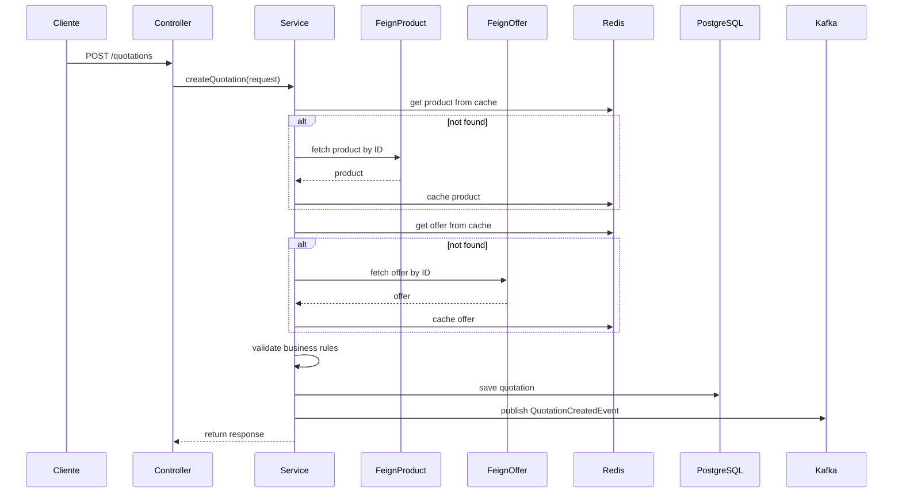
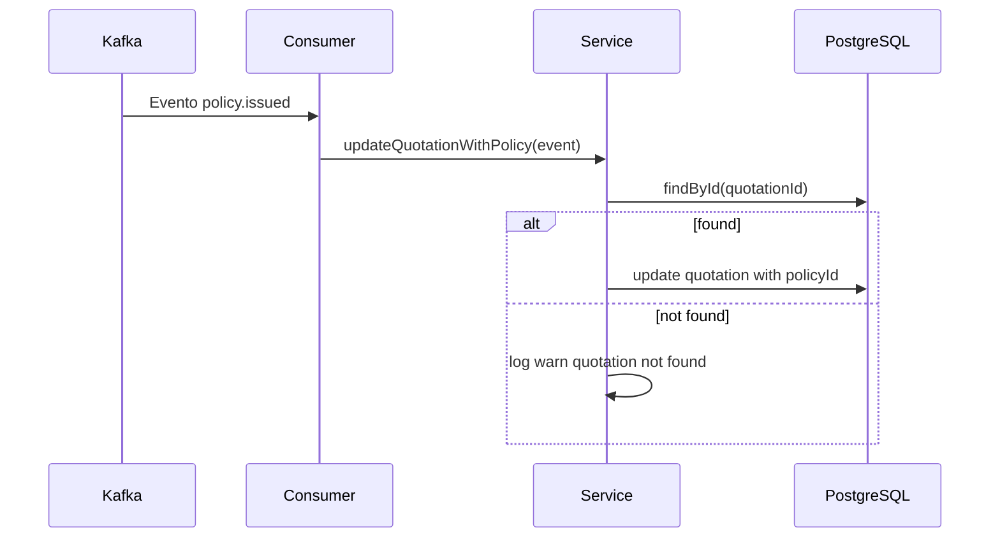
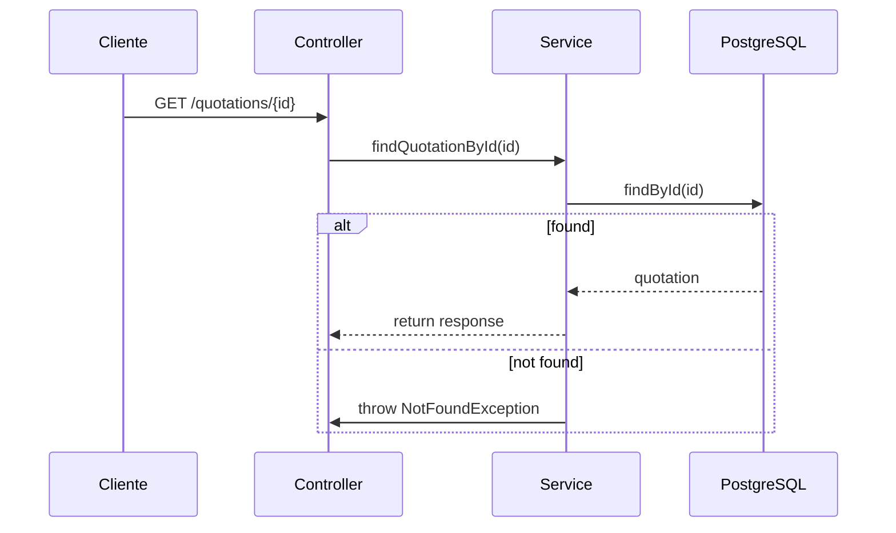

# Seguradora ACME

A API da Seguradora ACME é uma solução robusta e escalável para cotações de seguro. Ela integra com um sistema externo de Catálogo de Produtos e Ofertas (mockado via WireMock), armazena os dados em PostgreSQL, utiliza Redis para cache de catálogo, publica eventos em Kafka e adota um conjunto moderno de boas práticas de engenharia e arquitetura de software.

Essa solução simula o processo de cotação de seguros, desde a criação até a emissão da apólice, incluindo validações de catálogo e comunicação entre sistemas desacoplados. Foi desenvolvida com foco em legibilidade, manutenibilidade, rastreabilidade e testes confiáveis. Toda a estrutura segue princípios sólidos como Clean Architecture, SOLID e DDD, com separação clara entre regras de negócio e detalhes técnicos, o que facilita a evolução do projeto no longo prazo.

## 🔎 Visão Geral

Esse projeto simula o fluxo real de cotações em uma seguradora, considerando não só a criação e consulta de cotações, mas também a atualização via eventos Kafka (por exemplo, quando uma apólice é emitida).

Principais diferenciais que apliquei:

- ✅ Arquitetura limpa e desacoplada com inversão de dependência via interfaces
- ✅ Testes robustos com cobertura unitária e de integração (PostgreSQL, Redis, Kafka, WireMock)
- ✅ Integrações externas mockadas via WireMock com respostas controladas por JSON
- ✅ Contêinerização completa com docker-compose
- ✅ Documentação e testes manuais com Swagger e Postman
- ✅ Observabilidade com logs estruturados em JSON e Actuator + Prometheus
- ✅ Pipeline de qualidade com Checkstyle, PMD, formatter e JaCoCo

## 🧠 Premissas e Decisões Técnicas

Durante o desenvolvimento dessa aplicação, priorizei clareza, testabilidade, desacoplamento e capacidade de evolução do código. O projeto foi estruturado com Clean Architecture, separando bem as responsabilidades entre domínio, aplicação e infraestrutura.

Utilizei conceitos de Domain-Driven Design (DDD) para modelar o domínio de forma fiel ao negócio. Entidades como Quotation, Product, Offer e Customer foram criadas com foco na lógica real de uma seguradora.

Apliquei princípios SOLID:

- Responsabilidade Única: cada classe tem um papel claro
- Aberto/Fechado: novas regras sem alterar código existente
- Inversão de Dependência: as interfaces no domínio são implementadas nas camadas externas

Escolhi Redis como cache apenas para o catálogo, pois são dados pouco mutáveis. Cotações não usam cache por serem sensíveis a atualizações.

Kafka foi usado para comunicação assíncrona entre serviços, como quando uma apólice é emitida. Isso foi implementado com interfaces no domínio e publicação via KafkaTemplate na infraestrutura.

Feign Client facilita a integração com os serviços de catálogo. Adicionei um ErrorDecoder customizado para distinguir erros 4xx e 5xx.

Os mapeamentos entre entidades, DTOs e eventos foram gerados com MapStruct, garantindo segurança de tipo e evitando boilerplate.

Logs estruturados com Logback em JSON facilitam futuras integrações com ferramentas como Grafana e Loki. Swagger documenta a API, enquanto as validações com Bean Validation garantem entradas robustas.

Por fim, configurei um pre-commit hook com Checkstyle, PMD, formatter e JaCoCo para garantir que todo código enviado esteja dentro dos padrões de qualidade.

Toda dependência externa é desacoplada por interfaces, e os testes com Testcontainers garantem execução realista e segura. O ambiente de testes cobre tanto cenários esperados quanto falhas, validando o comportamento da aplicação de ponta a ponta.

## ⚙️ Como Rodar o Projeto

### ✅ Requisitos do Ambiente

Antes de rodar o projeto, é importante garantir que seu ambiente possua as seguintes ferramentas instaladas:

| **Ferramenta**          | **Versão** |
|-------------------------|------------|
| Java                    | 17         |
| Maven                   | 3.9+       |
| Docker + Docker Compose |            |
| Git                     |            |
| Postman (Opcional)      |            |

### 🔧 Localmente (sem Docker)

Se quiser rodar o projeto localmente:

```bash
# Compile e rode
mvn clean spring-boot:run
```

Mas lembre-se: ao rodar local, você precisará subir os serviços externos manualmente (PostgreSQL, Redis, Kafka, WireMock). Por isso, recomendo fortemente usar o Docker Compose:

### 🐳 Subindo via Docker

Para rodar toda a stack da aplicação com um único comando:

```bash
docker-compose down -v  # Para garantir um ambiente limpo
docker-compose up --build
```

🎯 Isso vai iniciar tudo necessário. A aplicação estará acessível em `http://localhost:8080`.

#### 📁 Serviços incluídos:

- A aplicação 
- PostgreSQL 
- PgAdmin 
- Redis 
- RedisInsight 
- Kafka 
- Kafka UI 
- WireMock (com mocks de Catálogo)

#### 🧭 Acessos úteis durante a execução:

| **Serviço** | **URL**                  | **Observação**                                      |
|----------------|---------------------------------|-----------------------------------------------------|
| Swagger UI     | http://localhost:8080/swagger-ui/index.html | Documentação da API                                 |
| PgAdmin            | http://localhost:5050  | Login: admin@admin.com / Senha: admin               |
| RedisInsight      | http://localhost:5540 | Conectar no host redis, porta 6379                  |
| Kafka UI	         | http://localhost:8085 | Interface visual para produção e consumo de eventos |
| WireMock Admin	            | http://localhost:8081/__admin | Interface de gerenciamento dos mocks do catálogo    |

## 📅 Documentação da API

### Swagger

- [Swagger UI](http://localhost:8080/swagger-ui/index.html)
- [API Docs JSON](http://localhost:8080/v3/api-docs)

> A documentação é gerada automaticamente com `springdoc-openapi`.

### Postman

Para facilitar seus testes manuais, uma coleção Postman com todos os cenários está disponível em:

[./docs/collection/ACME Insurance.postman_collection.json](./docs/collection/ACME Insurance.postman_collection.json)

## 📦 Estrutura do Projeto

Abaixo você encontra a explicação das principais camadas do projeto com seus pacotes e responsabilidades.
```
├───config
│   ├───database
│   └───hooks
├───docs
│   └───collection
├───src
│   ├───main
│   │   ├───java
│   │   │   └───com
│   │   │       └───acmeinsurance
│   │   │           ├───application
│   │   │           │   ├───cache
│   │   │           │   ├───messaging
│   │   │           │   ├───service
│   │   │           │   └───usecase
│   │   │           ├───config
│   │   │           ├───domain
│   │   │           │   ├───entity
│   │   │           │   ├───enums
│   │   │           │   ├───exception
│   │   │           │   ├───gateway
│   │   │           │   └───repository
│   │   │           └───infrastructure
│   │   │               ├───cache
│   │   │               │   └───redis
│   │   │               │       ├───config
│   │   │               │       └───factory
│   │   │               ├───integration
│   │   │               │   ├───adapter
│   │   │               │   ├───dto
│   │   │               │   │   └───response
│   │   │               │   ├───feign
│   │   │               │   │   ├───config
│   │   │               │   │   └───decoder
│   │   │               │   └───mapper
│   │   │               ├───messaging
│   │   │               │   ├───dto
│   │   │               │   │   └───event
│   │   │               │   ├───kafka
│   │   │               │   │   └───config
│   │   │               │   └───mapper
│   │   │               ├───persistence
│   │   │               │   ├───entity
│   │   │               │   │   └───embeddable
│   │   │               │   └───mapper
│   │   │               └───web
│   │   │                   ├───controller
│   │   │                   ├───dto
│   │   │                   │   ├───common
│   │   │                   │   ├───request
│   │   │                   │   └───response
│   │   │                   ├───exception
│   │   │                   └───mapper
│   │   └───resources
│   └───test
│       ├───java
│       │   └───com
│       │       └───acmeinsurance
│       │           ├───architecture
│       │           ├───integration
│       │           ├───unit
│       │           │   ├───application
│       │           │   │   └───service
│       │           │   ├───domain
│       │           │   │   ├───entity
│       │           │   │   └───exception
│       │           │   └───infrastructure
│       │           │       ├───cache
│       │           │       │   └───redis
│       │           │       │       └───factory
│       │           │       ├───integration
│       │           │       │   ├───adapter
│       │           │       │   ├───feign
│       │           │       │   │   └───decoder
│       │           │       │   └───mapper
│       │           │       ├───messaging
│       │           │       │   ├───kafka
│       │           │       │   └───mapper
│       │           │       ├───persistence
│       │           │       │   └───mapper
│       │           │       └───web
│       │           │           ├───controller
│       │           │           ├───exception
│       │           │           └───mapper
│       │           └───util
│       └───resources
│           ├───integration
│           │   └───quotation
│           │       ├───event
│           │       ├───request
│           │       └───response
│           └───wiremock
│               ├───mappings
│               └───__files
```

---

#### 🟣 1. domain — Coração da aplicação

Camada mais pura. Não depende de framework, banco, Kafka ou HTTP.

| **Pacote**          | **Descrição**                                                                      |
|-------------------------|------------------------------------------------------------------------------------|
| entity                    | Contém modelos de negócio como Quotation, Product, Customer, Offer, PolicyIssued   |
| repository                   | Interface de persistência (QuotationRepository)                                    |
| gateway	 | Interfaces para comunicação com sistemas externos (Catálogo de Produtos e Ofertas) |
| exception                     | Exceções específicas de negócio                                                    |
| enums      | Tipos como Category, CustomerType, Gender                                          |

🎯 Tudo aqui é agnóstico, totalmente testável e reutilizável.

---

#### 🔵 2. application — Orquestração dos casos de uso

Aqui ficam os serviços de aplicação, que combinam as regras do domínio com acesso a recursos externos via interfaces.

| **Pacote**          | **Descrição**                                                                               |
|-------------------------|---------------------------------------------------------------------------------------------|
| usecase                    | Interfaces que descrevem o que cada caso de uso faz                                         |
| service                   | Implementações dos casos de uso: criação, consulta, atualização de cotação                  |
| messaging | Interface QuotationCreatedPublisher para publicar eventos sem depender de Kafka diretamente |
| cache                     | Interface CacheService<T> genérica para abstrair o Redis                                    |

🧠 Essa camada nunca conhece o banco, Kafka, HTTP ou Feign. Tudo vem via interface.

---

#### 🟠 3. infrastructure — Implementações técnicas

Camada onde usamos frameworks e tecnologias (Spring Boot, JPA, Redis, Feign, Kafka...).

##### a. `infrastructure.persistence`


| **Pacote**          | **Descrição**                                                           |
|-------------------------|-------------------------------------------------------------------------|
| entity, embeddable                    | Entidades JPA (QuotationEntity) e objetos embutidos (CustomerEmbeddable) |
| mapper                   | Mapeamento entre entidade JPA e domínio (QuotationJpaMapper)            |
| QuotationRepositoryImpl | Implementação da interface do domínio usando JPA                        |
| JpaQuotationRepository                     | Interface Spring Data JPA                                               |

##### b. `infrastructure.cache.redis`

| **Pacote**          | **Descrição**                                                     |
|-------------------------|-------------------------------------------------------------------|
| RedisCacheService                    | Implementa CacheService<T> com RedisTemplate tipado               |
| factory, config                   | Criação e configuração dos RedisTemplate para produtos e ofertas  |

##### c. `infrastructure.integration`

| **Pacote**          | **Descrição**                                                                           |
|-------------------------|-----------------------------------------------------------------------------------------|
| feign                    | Clientes Feign para Catálogo de Produtos e Ofertas                                      |
| adapter                   | Implementações de ProductCatalogDataGateway e OfferCatalogDataGateway com uso de cache  |
| dto.response | Objetos recebidos do serviço externo de Catálogo                                        |
| mapper                     | Mapeamento entre DTOs e entidades do domínio                                            |

##### d. `infrastructure.messaging.kafka`

| **Pacote**          | **Descrição**                                                                      |
|-------------------------|------------------------------------------------------------------------------------|
| kafka                    | Consumidor (KafkaPolicyIssuedConsumer) e produtor (KafkaQuotationCreatedPublisher) |
| dto.event                   | Eventos trafegados no Kafka                                                        |
| mapper | Conversão entre eventos Kafka e entidades de domínio                               |
| config                     | Configuração dos consumidores e produtores Kafka                                   |

#### e. `infrastructure.integration`
Responsável pela camada de **entrada da aplicação (controllers REST)** e formatação de dados HTTP.

| **Pacote**          | **Descrição**                                                                |
|-------------------------|------------------------------------------------------------------------------|
| controller                    | 	Exposição REST (QuotationController)                         |
| dto.request/response                   | Dados de entrada e saída da API                                              |
| exception | GlobalExceptionHandler com tratamento padronizado e códigos HTTP apropriados |
| mapper                     | Conversão entre DTOs HTTP e entidades do domínio                             |

---

#### 🟢 4. config — Centralização de propriedades

| **Pacote**          | **Descrição**                                                                        |
|-------------------------|--------------------------------------------------------------------------------------|
| KafkaProperties                    | 	Agrupa os nomes dos tópicos e grupo de consumidores (via @ConfigurationProperties)  |
| CatalogCacheProperties                   | Define TTLs do cache por domínio (produto e oferta)                                  |

---

#### 🔸 5. Raiz do Projeto
Classe principal da aplicação com `@SpringBootApplication`, responsável por habilitar Feign e registrar as configs.

| **Pacote**          | **Descrição**                                                                   |
|-------------------------|---------------------------------------------------------------------------------|
| AcmeInsuranceApplication                    | 	Classe principal com @SpringBootApplication, habilita Feign e importa configs  |

---

## 🌍 Qualidade de Código e Engenharia

Durante o desenvolvimento, utilizei ferramentas que ajudam a manter um código limpo, legível, padronizado, sem falhas comuns, e com testes realmente eficazes. Abaixo, uma explicação sobre cada uma:

### 🔹 Checkstyle

Usado para garantir que o código Java siga um padrão de estilo. No projeto, usei a convenção Google Java Style com algumas regras customizadas.

🧠 Por que usar? 

> Ajuda a manter um padrão visual no projeto todo, facilita leitura e revisão de código.

🔧 Para rodar manualmente:

```bash
mvn checkstyle:check
```

### 🔸 PMD

Detecta más práticas e possíveis bugs: variáveis não utilizadas, blocos vazios, duplicações, etc.

🧠 Por que usar?

> Evita problemas silenciosos no código, como complexidade desnecessária e lógica quebrada.

🔧 Para rodar manualmente:

```bash
mvn pmd:check
```

### 🔹 Formatter Maven Plugin

Aplica a formatação automática com base em um arquivo XML de estilo (o `config/formatter.xml`).

🧠 Por que usar?

> Evita discussões sobre espaçamento ou estilo. Um time = um padrão = menos ruído em PRs.

🔧  Para formatar tudo:

```bash
mvn formatter:format
```

### 🧬 PIT (Mutation Testing)

Executa testes de mutação, simulando pequenos bugs no código para ver se os testes os detectam.

🧠 Por que usar?

> Garante que os testes realmente cobrem o comportamento da aplicação. Não basta ter cobertura alta: tem que ser eficaz.

🔧 Para rodar:

```bash
mvn pitest:mutationCoverage
```

### 📍 Hooks de pré-commit

Também usei um hook Git (`config/hooks/pre-commit`) para que nenhum código seja commitado sem passar nas ferramentas acima.

Ele roda automaticamente:

- Formatter 
- Checkstyle 
- PMD 
- Testes com Jacoco

## 🧪 Testes Automatizados

A estratégia de testes foi pensada para garantir confiança, segurança para refatorações e validação do comportamento real da aplicação.

### 📂 Estrutura dos Testes

- `architecture/` → Testes de arquitetura com ArchUnit. 
- `integration/` → Fluxos completos com banco, Kafka, Redis, WireMock, etc. usando Testcontainers
- `unit/` → Testes isolados com mocks para regras de negócio, mapeamentos, cache etc.
- `util/` → JsonUtils, KafkaConsumerTestHelper, KafkaProducerTestHelper, QuotationTestFactory

### ✅ Testes Unitários

Usei JUnit e Mockito para testar os serviços, repositórios, mappers e validadores isoladamente, cobrindo cenários positivos, negativos e de exceção.

> Os testes seguem a convenção:
> should<ResultadoEsperado>When<Condição>()

### ✅ Testes de Integração com Testcontainers

Utilizei o Testcontainers para simular um ambiente real com:

- PostgreSQL 
- Redis 
- Kafka (Confluent)
- WireMock (serviços de catálogo mockados)

Tudo isso com containers isolados para cada teste, evitando interferência entre os testes.

> Os testes são executados com o profile test e rodam com @SpringBootTest, @Testcontainers e @AutoConfigureMockMvc.

Exemplos:
- CreateQuotationIntegrationTest 
- FindQuotationIntegrationTest 
- UpdateQuotationIntegrationTest

### ✅ Testes de Arquitetura com ArchUnit

Testes com ArchUnit garantem que a Clean Architecture está sendo respeitada.
Ou seja: infraestrutura nunca acessa diretamente a aplicação, e domínio é isolado.

📄 Exemplo: LayersTest.java

### 🎭 Testes com WireMock

Usei o WireMock em container para simular os serviços de produto e oferta do Catálogo.

Os mocks ficam em:

```
src/test/resources/wiremock
├── __files
├── mappings
```

### 📦 TestFactory com Dados Reutilizáveis

A classe `QuotationTestFactory` centraliza:

- Mocks de entidades 
- UUIDs fixos 
- Eventos prontos (QuotationCreatedEvent, PolicyIssuedEvent)
- DTOs para request e response 
- Simulações de produtos e ofertas

> Isso evita duplicação, melhora a manutenção dos testes e mantém consistência.

### 📈 Cobertura de Código com JaCoCo

Usei o plugin `jacoco-maven-plugin` para gerar relatórios de cobertura automaticamente.

```bash
mvn test jacoco:report
```

📄 Relatório em:
`target/site/jacoco/index.html`

> O projeto mantém alta cobertura, com foco nas regras de negócio, validações e mapeamentos.

## 🔎 Observabilidade e Monitoramento

### 📝 Logs Estruturados com Logback

Utilizei Logback configurado com logs estruturados em JSON, para garantir logs estruturados que podem ser lidos por ferramentas como Loki.
- No profile local, os logs são formatados para facilitar o desenvolvimento.

### 📡 Métricas com Spring Boot Actuator

A aplicação está equipada com o `spring-boot-starter-actuator`, expondo endpoints úteis para monitoramento:
- `/actuator/health` → Verifica saúde da aplicação 
- `/actuator/prometheus` → Exporta métricas no padrão Prometheus 
- `/actuator/info` → Pode ser customizado com infos do projeto 
- `/actuator` → Lista todos os endpoints disponíveis

## 📋 Funcionalidades

### 🚀 Criar Cotação

Essa funcionalidade permite registrar uma nova cotação de seguro com base em um produto e oferta vindos do Catálogo. A lógica inclui:

- Validação dos dados de entrada (Bean Validation)
- Verificação se o produto e oferta existem e estão ativos 
- Regras de negócio:
  - A oferta deve pertencer ao produto 
  - Coberturas e assistências devem estar listadas no catálogo 
  - Valores de cobertura não podem exceder o máximo 
  - Valor do prêmio deve estar dentro da faixa permitida 
  - A soma das coberturas deve bater com o total 
- Persistência em PostgreSQL 
- Cache de produto e oferta em Redis 
- Publicação do evento QuotationCreatedEvent no Kafka



| **Método** | **Endpoint**                   | **Descrição**          |
|----------------|----------------------------------|------------------------|
| POST     | 	`/quotations`                | Cria uma nova cotação  |

#### 🟢 Cotação criada com sucesso

Produto e oferta ativos, todos os dados válidos.

##### Request:

```json
{
    "productId": "1b2da7cc-b367-4196-8a78-9cfeec21f587",
    "offerId": "adc56d77-348c-4bf0-908f-22d402ee715c",
    "category": "HOME",
    "totalMonthlyPremiumAmount": 75.25,
    "totalCoverageAmount": 825000.00,
    "coverages": {
        "Incêndio": 250000.00,
        "Desastres naturais": 500000.00,
        "Responsabilidade civil": 75000.00
    },
    "assistances": [
        "Encanador",
        "Eletricista",
        "Chaveiro 24h"
    ],
    "customer": {
        "documentNumber": "36205578900",
        "name": "John Wick",
        "type": "NATURAL",
        "gender": "MALE",
        "dateOfBirth": "1973-05-02",
        "email": "johnwick@gmail.com",
        "phoneNumber": 11950503030
    }
}
```

##### Response:

```json
{
    "id": 1,
    "insurancePolicyId": null,
    "productId": "1b2da7cc-b367-4196-8a78-9cfeec21f587",
    "offerId": "adc56d77-348c-4bf0-908f-22d402ee715c",
    "category": "HOME",
    "createdAt": "2025-04-15T00:57:49.422633634",
    "updatedAt": "2025-04-15T00:57:49.422633634",
    "totalMonthlyPremiumAmount": 75.25,
    "totalCoverageAmount": 825000,
    "coverages": {
        "Incêndio": 250000,
        "Desastres naturais": 500000,
        "Responsabilidade civil": 75000
    },
    "assistances": [
        "Encanador",
        "Eletricista",
        "Chaveiro 24h"
    ],
    "customer": {
        "documentNumber": "36205578900",
        "name": "John Wick",
        "type": "NATURAL",
        "gender": "MALE",
        "dateOfBirth": "1973-05-02",
        "email": "johnwick@gmail.com",
        "phoneNumber": 11950503030
    }
}
```

#### 🔴 Product Inativo

Trocar o `productId` por um inativo.

##### Request:

```json
{
    "productId": "edaa71d6-4f31-4f6a-a3cb-59949d48ad5e",
    "offerId": "adc56d77-348c-4bf0-908f-22d402ee715c",
    "category": "HOME",
    "totalMonthlyPremiumAmount": 75.25,
    "totalCoverageAmount": 825000.00,
    "coverages": {
        "Incêndio": 250000.00,
        "Desastres naturais": 500000.00,
        "Responsabilidade civil": 75000.00
    },
    "assistances": [
        "Encanador",
        "Eletricista",
        "Chaveiro 24h"
    ],
    "customer": {
        "documentNumber": "36205578900",
        "name": "John Wick",
        "type": "NATURAL",
        "gender": "MALE",
        "dateOfBirth": "1973-05-02",
        "email": "johnwick@gmail.com",
        "phoneNumber": 11950503030
    }
}
```

##### Response:

```json
{
    "code": "422",
    "message": "Product is inactive"
}
```

#### 🔴 Produto não encontrado

Trocar o `productId` por um produto não existente.

##### Request:

```json
{
    "productId": "00000000-0000-0000-0000-000000000000",
    "offerId": "adc56d77-348c-4bf0-908f-22d402ee715c",
    "category": "HOME",
    "totalMonthlyPremiumAmount": 75.25,
    "totalCoverageAmount": 825000.00,
    "coverages": {
        "Incêndio": 250000.00,
        "Desastres naturais": 500000.00,
        "Responsabilidade civil": 75000.00
    },
    "assistances": [
        "Encanador",
        "Eletricista",
        "Chaveiro 24h"
    ],
    "customer": {
        "documentNumber": "36205578900",
        "name": "John Wick",
        "type": "NATURAL",
        "gender": "MALE",
        "dateOfBirth": "1973-05-02",
        "email": "johnwick@gmail.com",
        "phoneNumber": 11950503030
    }
}
```

##### Response:

```json
{
    "code": "404",
    "message": "Product with ID [00000000-0000-0000-0000-000000000000] not found"
}
```

#### 🔴 Oferta inativa

Trocar o `offerId` por um inativo.

##### Request:

```json
{
    "productId": "1b2da7cc-b367-4196-8a78-9cfeec21f587",
    "offerId": "b56de912-cd30-4795-962e-07327eceba5c",
    "category": "HOME",
    "totalMonthlyPremiumAmount": 75.25,
    "totalCoverageAmount": 825000.00,
    "coverages": {
        "Incêndio": 250000.00,
        "Desastres naturais": 500000.00,
        "Responsabilidade civil": 75000.00
    },
    "assistances": [
        "Encanador",
        "Eletricista",
        "Chaveiro 24h"
    ],
    "customer": {
        "documentNumber": "36205578900",
        "name": "John Wick",
        "type": "NATURAL",
        "gender": "MALE",
        "dateOfBirth": "1973-05-02",
        "email": "johnwick@gmail.com",
        "phoneNumber": 11950503030
    }
}
```

##### Response:

```json
{
    "code": "422",
    "message": "Offer is inactive"
}
```

#### 🔴 Oferta não encontrada

Trocar `offerId` por uma oferta não existente.

##### Request:

```json
{
    "productId": "1b2da7cc-b367-4196-8a78-9cfeec21f587",
    "offerId": "00000000-0000-0000-0000-000000000000",
    "category": "HOME",
    "totalMonthlyPremiumAmount": 75.25,
    "totalCoverageAmount": 825000.00,
    "coverages": {
        "Incêndio": 250000.00,
        "Desastres naturais": 500000.00,
        "Responsabilidade civil": 75000.00
    },
    "assistances": [
        "Encanador",
        "Eletricista",
        "Chaveiro 24h"
    ],
    "customer": {
        "documentNumber": "36205578900",
        "name": "John Wick",
        "type": "NATURAL",
        "gender": "MALE",
        "dateOfBirth": "1973-05-02",
        "email": "johnwick@gmail.com",
        "phoneNumber": 11950503030
    }
}
```

##### Response:

```json
{
    "code": "404",
    "message": "Offer with ID [00000000-0000-0000-0000-000000000000] not found"
}
```

#### 🔴 Oferta não pertence ao produto

Trocar `offerId` por uma oferta válida, mas que pertence a outro produto.

##### Request:

```json
{
    "productId": "1b2da7cc-b367-4196-8a78-9cfeec21f587",
    "offerId": "4b4b5df2-c7e8-4497-a5b9-e76e985ca49e",
    "category": "HOME",
    "totalMonthlyPremiumAmount": 75.25,
    "totalCoverageAmount": 825000.00,
    "coverages": {
        "Incêndio": 250000.00,
        "Desastres naturais": 500000.00,
        "Responsabilidade civil": 75000.00
    },
    "assistances": [
        "Encanador",
        "Eletricista",
        "Chaveiro 24h"
    ],
    "customer": {
        "documentNumber": "36205578900",
        "name": "John Wick",
        "type": "NATURAL",
        "gender": "MALE",
        "dateOfBirth": "1973-05-02",
        "email": "johnwick@gmail.com",
        "phoneNumber": 11950503030
    }
}
```

##### Response:

```json
{
    "code": "422",
    "message": "Offer does not belong to the specified product"
}
```

#### 🔴 Cobertura inválida (não está no catálogo)

Adicionar uma cobertura que não existe na oferta.

##### Request:

```json
{
    "productId": "1b2da7cc-b367-4196-8a78-9cfeec21f587",
    "offerId": "adc56d77-348c-4bf0-908f-22d402ee715c",
    "category": "HOME",
    "totalMonthlyPremiumAmount": 75.25,
    "totalCoverageAmount": 825000.00,
    "coverages": {
        "Incêndio": 250000.00,
        "Desastres naturais": 500000.00,
        "Cobertura Inexistente": 1000.00
    },
    "assistances": [
        "Encanador",
        "Eletricista",
        "Chaveiro 24h"
    ],
    "customer": {
        "documentNumber": "36205578900",
        "name": "John Wick",
        "type": "NATURAL",
        "gender": "MALE",
        "dateOfBirth": "1973-05-02",
        "email": "johnwick@gmail.com",
        "phoneNumber": 11950503030
    }
}
```

##### Response:

```json
{
    "code": "422",
    "message": "Coverage [Cobertura Inexistente] is not available in the offer"
}
```

#### 🔴 Cobertura acima do máximo permitido

Exagerar o valor de uma cobertura.

##### Request:

```json
{
    "productId": "1b2da7cc-b367-4196-8a78-9cfeec21f587",
    "offerId": "adc56d77-348c-4bf0-908f-22d402ee715c",
    "category": "HOME",
    "totalMonthlyPremiumAmount": 75.25,
    "totalCoverageAmount": 825000.00,
    "coverages": {
        "Incêndio": 9999999.00,
        "Desastres naturais": 200000.00,
        "Responsabilidade civil": 100000.00
    },
    "assistances": [
        "Encanador",
        "Eletricista",
        "Chaveiro 24h"
    ],
    "customer": {
        "documentNumber": "36205578900",
        "name": "John Wick",
        "type": "NATURAL",
        "gender": "MALE",
        "dateOfBirth": "1973-05-02",
        "email": "johnwick@gmail.com",
        "phoneNumber": 11950503030
    }
}
```

##### Response:

```json
{
    "code": "422",
    "message": "Coverage [Incêndio] exceeds max allowed value"
}
```

#### 🔴 Assistência inválida (não está no catálogo)

Adicionar uma assistência que não existe na oferta.

##### Request:

```json
{
    "productId": "1b2da7cc-b367-4196-8a78-9cfeec21f587",
    "offerId": "adc56d77-348c-4bf0-908f-22d402ee715c",
    "category": "HOME",
    "totalMonthlyPremiumAmount": 75.25,
    "totalCoverageAmount": 825000.00,
    "coverages": {
        "Incêndio": 250000.00,
        "Desastres naturais": 500000.00,
        "Responsabilidade civil": 75000.00
    },
    "assistances": [
        "Assistência Inexistente"
    ],
    "customer": {
        "documentNumber": "36205578900",
        "name": "John Wick",
        "type": "NATURAL",
        "gender": "MALE",
        "dateOfBirth": "1973-05-02",
        "email": "johnwick@gmail.com",
        "phoneNumber": 11950503030
    }
}
```

##### Response:

```json
{
    "code": "422",
    "message": "Assistance [Assistência Inexistente] is not available in the offer"
}
```

#### 🔴 Prêmio fora da faixa da oferta

##### Request:

```json
{
    "productId": "1b2da7cc-b367-4196-8a78-9cfeec21f587",
    "offerId": "adc56d77-348c-4bf0-908f-22d402ee715c",
    "category": "HOME",
    "totalMonthlyPremiumAmount": 101.00,
    "totalCoverageAmount": 825000.00,
    "coverages": {
        "Incêndio": 250000.00,
        "Desastres naturais": 500000.00,
        "Responsabilidade civil": 75000.00
    },
    "assistances": [
        "Encanador",
        "Eletricista",
        "Chaveiro 24h"
    ],
    "customer": {
        "documentNumber": "36205578900",
        "name": "John Wick",
        "type": "NATURAL",
        "gender": "MALE",
        "dateOfBirth": "1973-05-02",
        "email": "johnwick@gmail.com",
        "phoneNumber": 11950503030
    }
}
```

##### Response:

```json
{
    "code": "422",
    "message": "Total monthly premium amount is outside the allowed range"
}
```

#### 🔴 Total de cobertura não bate com a soma

##### Request:

```json
{
    "productId": "1b2da7cc-b367-4196-8a78-9cfeec21f587",
    "offerId": "adc56d77-348c-4bf0-908f-22d402ee715c",
    "category": "HOME",
    "totalMonthlyPremiumAmount": 75.25,
    "totalCoverageAmount": 700000.00,
    "coverages": {
        "Incêndio": 250000.00,
        "Desastres naturais": 500000.00
    },
    "assistances": [
        "Encanador",
        "Eletricista",
        "Chaveiro 24h"
    ],
    "customer": {
        "documentNumber": "36205578900",
        "name": "John Wick",
        "type": "NATURAL",
        "gender": "MALE",
        "dateOfBirth": "1973-05-02",
        "email": "johnwick@gmail.com",
        "phoneNumber": 11950503030
    }
}
```

##### Response:

```json
{
    "code": "422",
    "message": "Total coverage amount does not match the sum of individual coverages"
}
```

#### 🔴 Campos obrigatórios ausentes

##### Request:

```json
{
    "productId": null,
    "offerId": "adc56d77-348c-4bf0-908f-22d402ee715c",
    "category": "HOME",
    "totalMonthlyPremiumAmount": 75.25,
    "totalCoverageAmount": 825000.00,
    "coverages": {
        "Incêndio": 250000.00,
        "Desastres naturais": 500000.00,
        "Responsabilidade civil": 75000.00
    },
    "assistances": [
        "Encanador",
        "Eletricista",
        "Chaveiro 24h"
    ],
    "customer": {
        "documentNumber": "36205578900",
        "name": "John Wick",
        "type": "NATURAL",
        "gender": "MALE",
        "dateOfBirth": "1973-05-02",
        "email": "johnwick@gmail.com",
        "phoneNumber": 11950503030
    }
}
```

##### Response:

```json
{
    "code": "400",
    "message": "These attributes are missing or are invalid",
    "errors": [
        {
            "field": "productId",
            "description": "Product ID is required"
        }
    ]
}
```

### 🔁 Atualizar Cotação com Apólice Emitida

Essa funcionalidade permite atualizar uma cotação já registrada, associando a ela o número da apólice emitida. Esse processo é feito de forma assíncrona através de um evento Kafka enviado para o tópico `policy.issued`.

O evento contém o `quotationId`, o `policyId` (número da apólice) e a `data da emissão`. Ao consumir esse evento, a aplicação busca a cotação correspondente e atualiza seus dados no banco.

Lógica:

- O `quotationId` precisa existir.
- Se a cotação não for encontrada, o evento é ignorado (com log de aviso).
- Nenhuma exceção é lançada para evitar reprocessamentos em massa com erro.



| **Origem** | **Tópico Kafka**                   | **Evento**          |
|----------------|----------------------------------|------------------------|
| Kafka     | 	`policy.issued`                | Atualiza cotação existente  |

**Exemplo de evento:**

```json
{
    "quotationId": 1,
    "policyId": 1001,
    "issuedAt": "2025-04-15T01:05:00"
}
```

Para simular manualmente no **Kafka UI**:

- Acesse http://localhost:8085
- Selecione o tópico `policy.issued`
- Clique em Produce Message 
- Insira o JSON acima no campo Value 
- Clique em Send

### 🔍 Consultar Cotação por ID

Essa funcionalidade permite recuperar os dados de uma cotação existente via chamada HTTP síncrona.

Lógica:

- Recebe um `id` como path param
- Verifica se a cotação existe no banco
- Retorna a estrutura completa da cotação
- Caso não encontre, responde com 404



| **Método** | **Endpoint**                   | **Descrição**          |
|----------------|----------------------------------|------------------------|
| GET     | 	`/quotations/{id}`                | Consulta cotação por ID  |

#### 🟢 Cotação encontrada com sucesso

##### Request:

> GET /quotations/1

##### Response:

```json
{
    "id": 1,
    "insurancePolicyId": null,
    "productId": "1b2da7cc-b367-4196-8a78-9cfeec21f587",
    "offerId": "adc56d77-348c-4bf0-908f-22d402ee715c",
    "category": "HOME",
    "createdAt": "2025-04-15T00:57:49.422634",
    "updatedAt": "2025-04-15T00:57:49.422634",
    "totalMonthlyPremiumAmount": 75.25,
    "totalCoverageAmount": 825000,
    "coverages": {
        "Incêndio": 250000,
        "Desastres naturais": 500000,
        "Responsabilidade civil": 75000
    },
    "assistances": [
        "Encanador",
        "Eletricista",
        "Chaveiro 24h"
    ],
    "customer": {
        "documentNumber": "36205578900",
        "name": "John Wick",
        "type": "NATURAL",
        "gender": "MALE",
        "dateOfBirth": "1973-05-02",
        "email": "johnwick@gmail.com",
        "phoneNumber": 11950503030
    }
}
```

#### 🔴 Cotação não encontrada

Usar um ID inexistente.

##### Request:

> GET /quotations/1001

##### Response:

```json
{
    "code": "404",
    "message": "Quotation with ID [1001] not found"
}
```

## ✈ Melhorias Futuras

- CI com GitHub Actions incluindo:
    - Build + testes + lint (checkstyle, pmd)
    - Execução de DAST com OWASP ZAP em container
    - Publicação de relatórios de cobertura e badges
- Integração com Grafana + Loki ou outra stack.