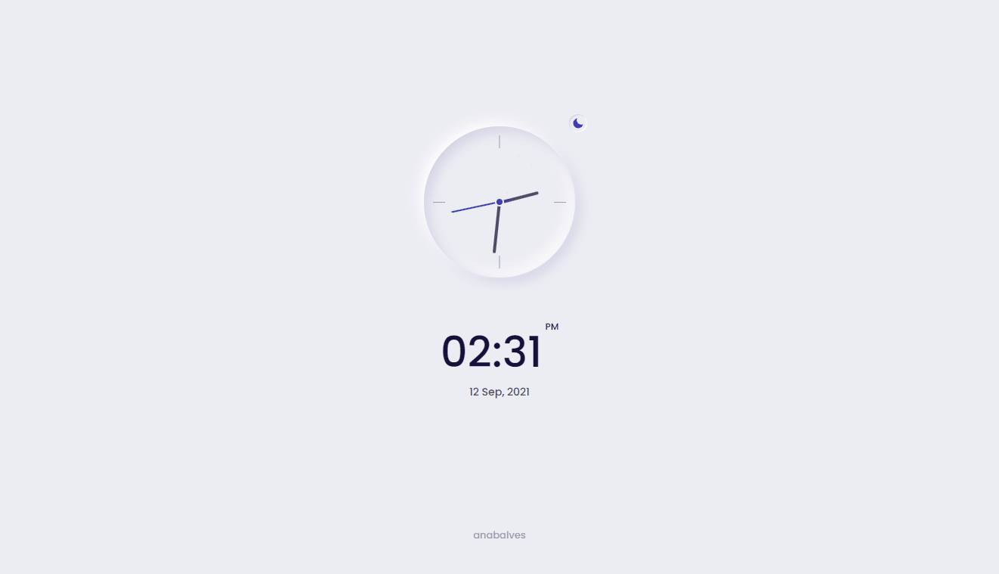
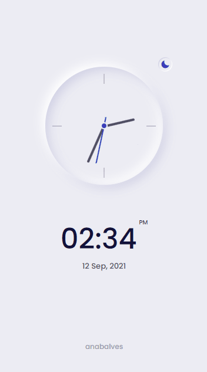
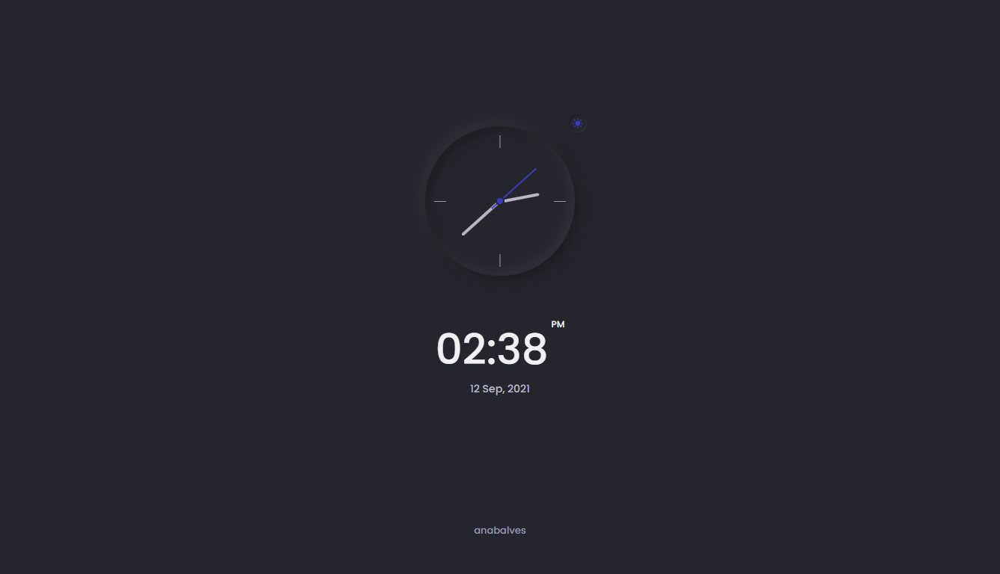
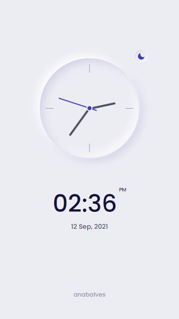

# 🕒 Analog Clock

The purpose of this project is to create an analog clock with a neumorphic design, and also with dark/light mode.

### 🚀 Technologies

This project was developed with the following technologies:

- HTML
- CSS
- Javascript

### 💻 Layout

