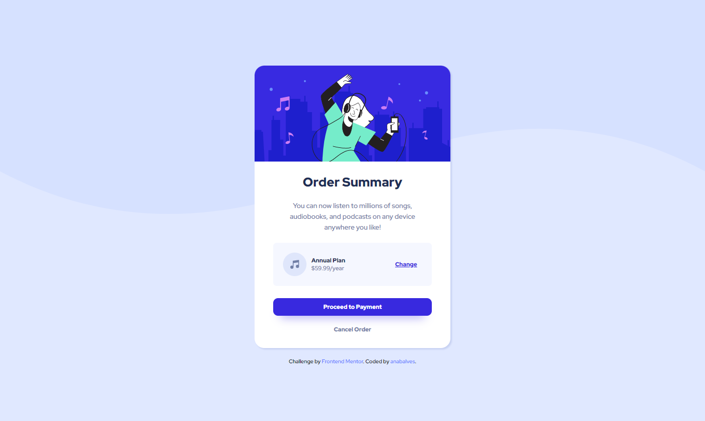

# Frontend Mentor - Order summary component

## The challenge

Your challenge is to build out this order summary card component and get it looking as close to the design as possible.

Your users should be able to:

- See hover states for interactive elements

## Screenshot Solution

  
  

##  Links

[Solution URL](https://www.frontendmentor.io/solutions/order-summary-component-wNLFPufv3_) 

[Live Site URL](https://order-summary-component-anabalves.netlify.app/) 

##  Built with
HTML

CSS
