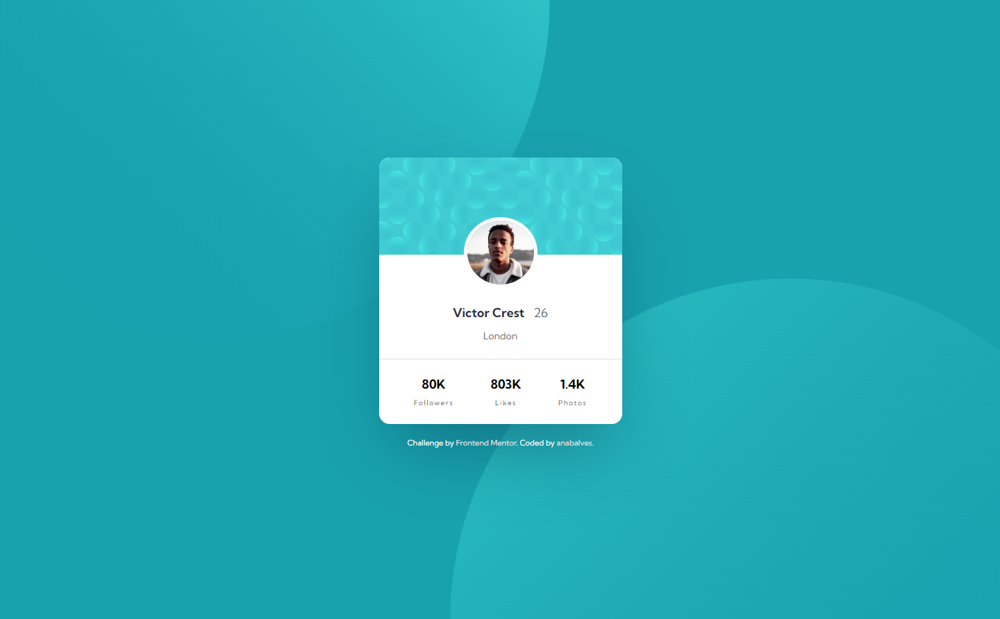
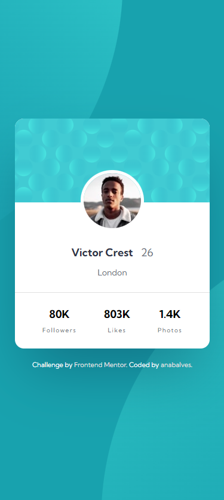

# Frontend Mentor - Profile card component

## The challenge

Your challenge is to build out this profile card component and get it looking as close to the design as possible.

## Screenshot Solution

  
  

##  Links

[Solution URL](https://www.frontendmentor.io/solutions/profile-card-component-4xUHCXa2wN) 

[Live Site URL](https://profile-card-component-anabalves.netlify.app/) 

##  Built with
HTML

CSS