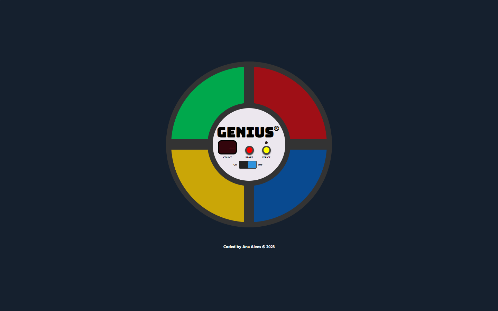
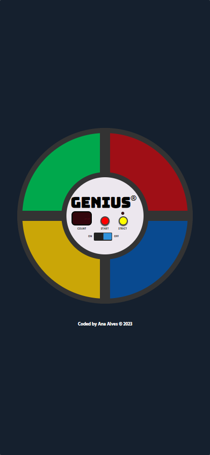

# Genius Game

<table>
  <tr>
    <td align="center"></td>
    <td align="center"></td>
  </tr>
</table>

This is a web-based implementation of the classic memory game "Genius." Test your memory and pattern recognition skills by repeating the sequences of colors and sounds in the correct order.

## Live Demo

Check out the live demo of the Genius Game [here](https://genius-game-anabalves.netlify.app).

## Features

- A fun and challenging game to test your memory.
- Colorful and engaging user interface.
- Increasing difficulty levels as you progress.
- High score tracking to compete with your friends.

## How to Play

1. Turn on the game using the switch button.
2. Click the "Start" button to begin the game.
3. Watch and listen carefully as the computer plays a sequence of colors and sounds.
4. Repeat the sequence by clicking the colored buttons in the correct order.
5. Each round adds one more step to the sequence, making the game progressively harder.
6. The game continues until you give up.

## Technologies Used

- HTML
- JavaScript
- CSS