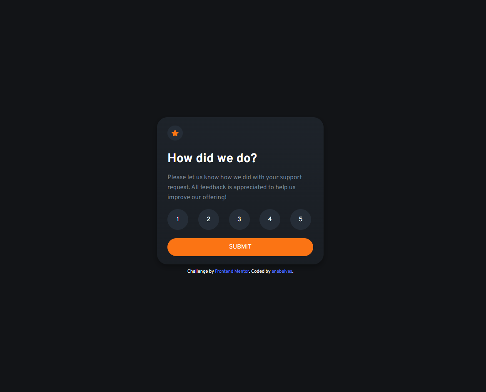
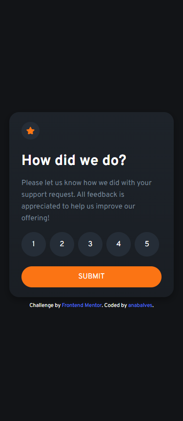

# Frontend Mentor - Interactive rating component

## The challenge

Your challenge is to build out this interactive rating component and get it looking as close to the design as possible.

Your users should be able to:

- View the optimal layout for the app depending on their device's screen size
- See hover states for all interactive elements on the page
- Select and submit a number rating
- See the "Thank you" card state after submitting a rating

## Screenshot Solution

  
  

##  Links

[Solution URL](https://www.frontendmentor.io/solutions/interactive-rating-component-rxlQ6QuJ3D) 

[Live Site URL](https://interactive-rating-component-anabalves.netlify.app/) 

##  Built with
- HTML
- CSS
- JavaScript
