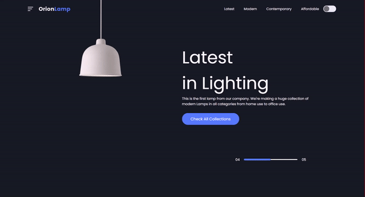
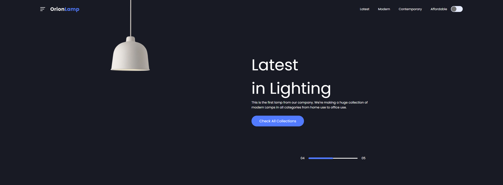
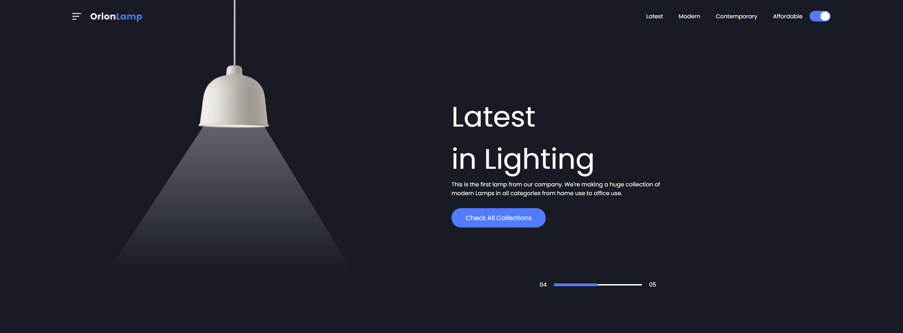

# 💡 OrionLamp

The purpose of this project is to learn how to create a website header and a toggle button to create a light lamp on and off effect.

### 🚀 Technologies

This project was developed with the following technologies:

- HTML
- CSS
- Javascript

### 💻 Layout

