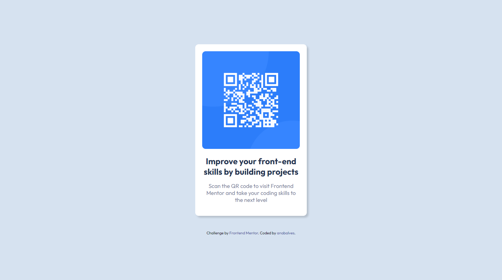
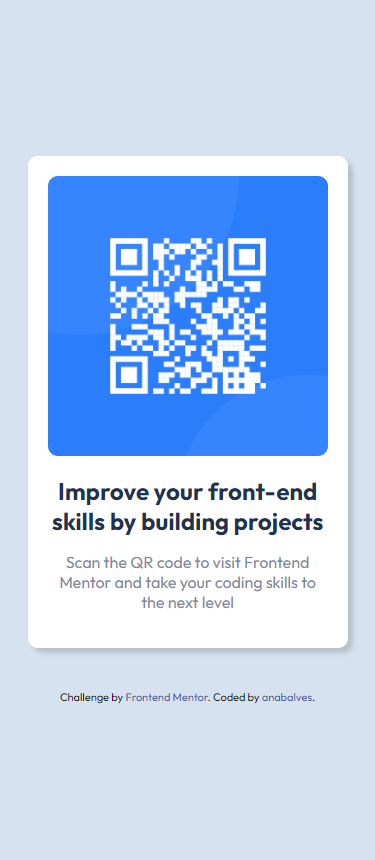

# Frontend Mentor - QR code component

## The challenge

Your challenge is to build out this QR code component and get it looking as close to the design as possible.

## Screenshot Solution

  
  

##  Links

[Solution URL](https://www.frontendmentor.io/solutions/qr-code-component-nIpjQjooMs) 

[Live Site URL](https://qr-code-component-anabalves.netlify.app/) 

##  Built with
- HTML
- CSS
