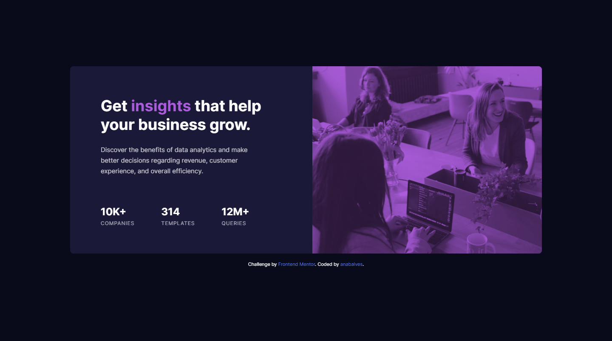
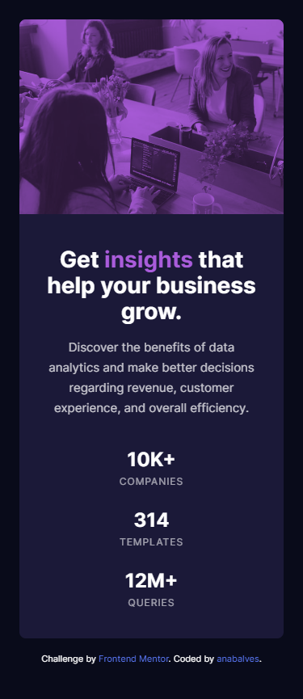

# Frontend Mentor - Stats preview card component

## The challenge

Your challenge is to build out this card component and get it looking as close to the design as possible.

Your users should be able to:

- View the optimal layout depending on their device's screen size

## Screenshot Solution

  
  

##  Links

[Solution URL](https://www.frontendmentor.io/solutions/stats-preview-card-component-id3C2tpz3q) 

[Live Site URL](https://stats-preview-card-component-anabalves.netlify.app/) 

##  Built with
HTML

CSS
