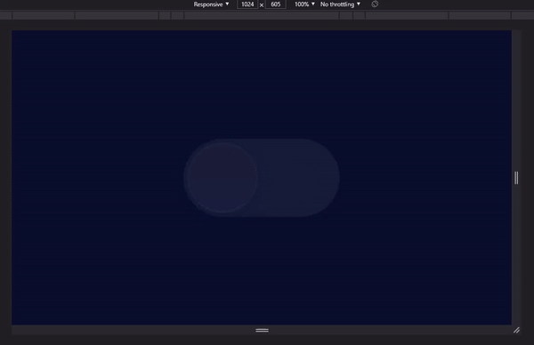
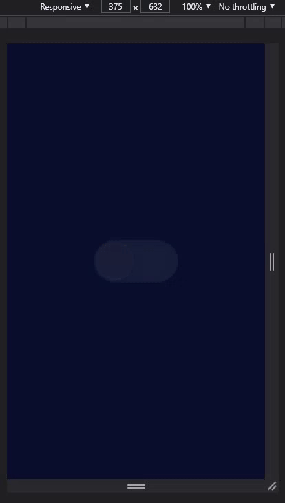
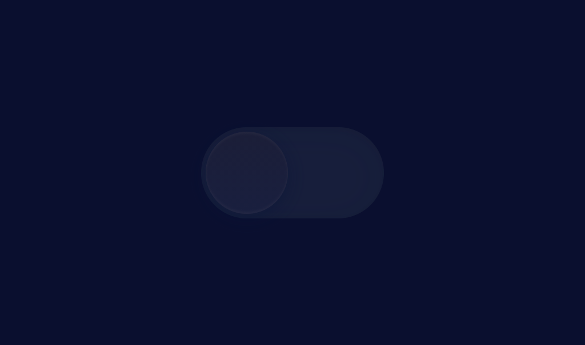
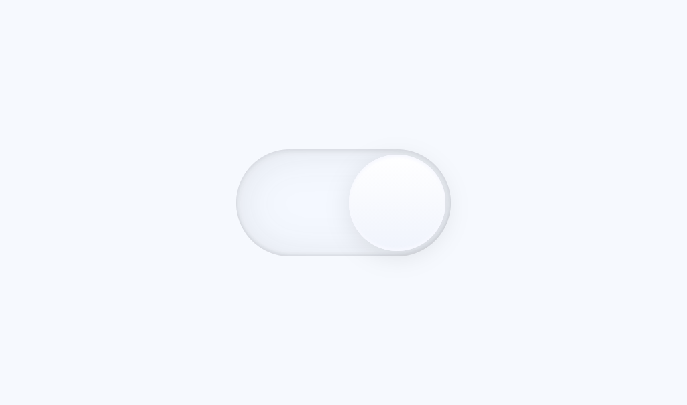

# Toggle Button | Dark and Light Mode

O propósito desse projeto é aprender a aplicar dark/light mode em websites usando HTML, CSS e JavaScript.

### 🚀 Technologies

This project was developed with the following technologies:

- HTML
- CSS
- Javascript

### 💻 Layout

